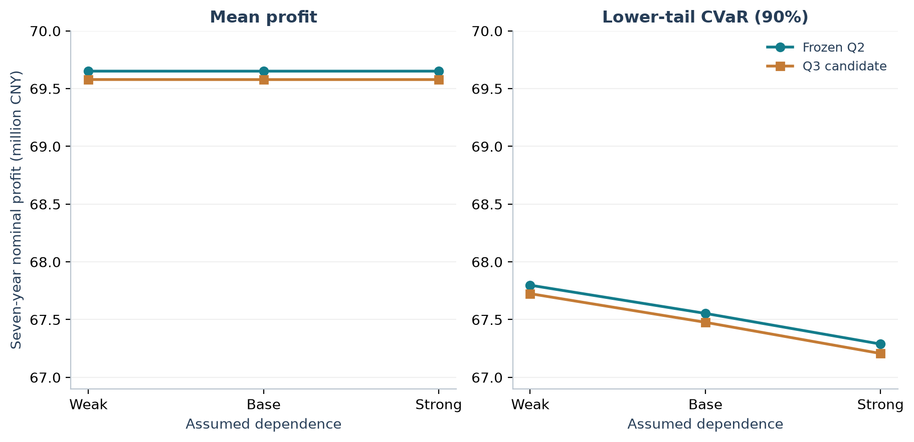

# 魏来平 · 数据分析与策略建模作品集

上海财经大学投资学 × 数学双学位本科生。关注如何把问题转成指标，用数据和模型比较方案，再把结论讲清楚。

这份作品集收录 **2026 年数学建模竞赛 C 题**与 **2024 年 C 题训练**，展示数据口径、策略分析、收益风险评价和可复现验证。我的角色是**建模方案审查、研究推进与成果整理**，AI 辅助实现的范围另有明确说明。

**先看：** [六页中文作品集 PDF](output/pdf/modeling-analytics-portfolio.pdf) · [可直接填写的项目经历](application/README.md) · [本次验证范围](docs/verification.md) · [贡献与 AI 辅助说明](docs/contribution-and-ai.md)

## 01 · 微网购电与储能调度：预测不确定性下的策略分析

**2026 年 9 月 · 正式竞赛 · 已提交参赛作品**

在负载与光伏存在预测偏差时，如何安排购电承诺、储能和日内合同调整？项目基于官方数据完成 334 日历史回放，把总费用拆成计划费、改约费与紧急购电费，并同时比较末库存。


- **分析发现：**F-fast 相对场景固定调度的现金费用降低 3.59%，主要来自紧急购电费用下降；两方案末库存分别为 8264.39 与 8221.73 kWh。
- **研究取舍：**重新审查充放电互斥结构，将代表日问题转为等价状态增量 LP，保留显式互斥模型对照及结论条件。
- **个人工作：**参与方案审查，主动要求重做第一问，参与修订取舍、审阅意见整合和成果核验。
- **结果边界：**同年回顾性策略比较，有明确量测与电价信息条件，不等同于现实场站节费。

[阅读案例与复现代码 →](projects/microgrid-2026/README.md) · [关键研究记录](projects/microgrid-2026/research-history.md)

## 02 · 农业种植规划：收益与风险的情景分析

**2026 年 8 月 · 采用 2024 年国赛 C 题训练**

面对销量、亩产、成本和价格的不确定性，如何评价 54 个地块、41 种作物的种植方案？研究使用 60 个优化情景生成方案，再以 3000 条模拟样本外路径评价固定方案。



- **分析发现：**在统一相关风险环境中，Q3 候选的均值和下尾 CVaR 均未超过冻结 Q2，因此保留有证据支持的基线。
- **研究取舍：**共同冲击增强主要压低下尾收益；复杂方法有助于风险披露，但未自动带来更优方案。
- **个人工作：**参与模型与假设审查、阶段采纳、结果冻结，以及论文和图表的证据整理。
- **结果边界：**利润来自设定随机模型下的七年名义模拟评价，相关因子与弹性不是本地数据估计值。

[阅读案例与复现代码 →](projects/agriculture-2024/README.md) · [关键研究记录](projects/agriculture-2024/research-history.md)

## 本仓库能说明什么

| 能力 | 可查看的证据 |
|---|---|
| 数据口径与质量意识 | 原始来源、单位与时间映射、规范化计算基础、输入哈希 |
| 指标与策略分析 | 费用拆分、收益与下尾风险、相同环境下的基线比较 |
| 研究判断 | 约束来源审查、模型结构简化、保留负结果和方法适用条件 |
| 成果表达 | 图表、案例说明、完整论文及可追溯的项目经历 |
| 可复现协作 | 源码、锁定依赖、独立运行入口、实际验证记录和 AI 使用范围 |

## 快速复现

使用 **Python 3.12**。在新的环境中安装已验证的依赖；以下命令均从仓库根执行。

```shell
python -m venv .venv
# Windows PowerShell: .\.venv\Scripts\Activate.ps1
# macOS / Linux: source .venv/bin/activate
python -m pip install -r requirements-lock.txt
python projects/microgrid-2026/verify_representative.py
python projects/agriculture-2024/scripts/reproduce.py
python scripts/build_figures.py
python scripts/build_portfolio.py
```

农业入口重算两个固定方案的 3000 条共同路径，可能需要数分钟。PDF 脚本在 Windows 使用系统微软雅黑；其他系统可通过 `PORTFOLIO_FONT`、`PORTFOLIO_BOLD_FONT` 指定兼容中文 TrueType 字体，或使用内置中文 CID 字体回退。字体文件不随仓库分发。

完整优化与官方附件获取分别见[微网复现说明](projects/microgrid-2026/reproduction/README.md)和[农业复现说明](projects/agriculture-2024/reproducibility.md)。历史全量优化的证据与本次代表性复现分开记录。

## 文件导航与来源

- `projects/`：两个案例、研究演进、派生数据、代码和核验记录。
- `assets/`：可从 CSV 重建的图表，附输入输出哈希。
- [完整论文](papers/README.md)：冻结版本的深入阅读入口与哈希。
- `application/`：短版、详细版项目经历与作品链接文字。
- `output/pdf/`：六页中文作品集。

赛题和附件来自全国大学生数学建模竞赛官方发布，原始工作簿不在本仓库重复分发。详见[来源与使用说明](NOTICE.md)。当前不声明奖项、真实业务增收、独立完成全部代码或未经证实的技能熟练程度。
