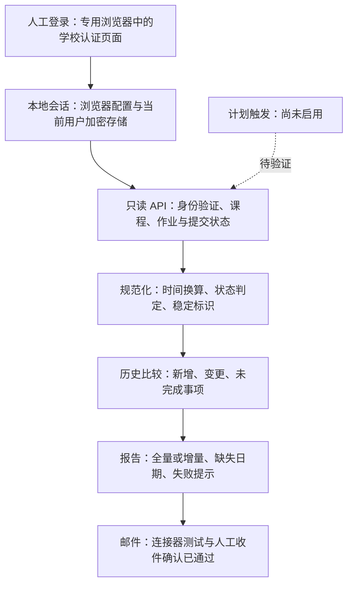

# 校园作业提醒 Agent

**2026 年 9 月 · 个人自动化项目 · 真实课程读取与邮件收件已验证，定时触发待验证**

把分散在各课程中的作业整理成两份清单：周五看所有未完成事项，周日看新增、变更和临近截止事项。

> 此目录只公开设计与开发过程。核心实现保留本地，真实课程、作业、账号、邮件地址和登录会话不进入本仓库。

## 问题与范围

每周逐门课程检查作业容易漏看，也难以发现老师修改了截止时间。本项目聚焦读取和提醒，不代写、不提交作业，不修改平台数据。

当前读取 Canvas 的 Assignments 及本人提交状态。未完成事项保留；已完成事项不参与新增提醒。独立测验、讨论、公告和附件中的要求尚未保证覆盖。

## 当前架构

浏览器负责建立学校认可的登录会话，结构化接口负责读取信息；两者不是互斥方案。
早期实现支持个人访问令牌，但当前实际采用专用浏览器会话，不要求使用者生成令牌。

## 关键设计

### 登录与凭据

用户只在学校页面自行登录，验证码和二次认证也由本人完成。程序不索取明文密码，不识别或绕过验证码。

会话按 Windows 当前用户加密保存在本机，只恢复目标平台适用的 Cookie，并检查保存时限和 Cookie 到期时间。服务器撤销会话后仍须重新登录。加密不能防御同一系统用户下的恶意进程，浏览器配置与加密文件都视作凭据，不外发。

“程序只发读取请求”是行为约束，不等于账号或 Cookie 本身只有读取权限。请求限制在目标站点，拒绝跨站分页和自动重定向。

### 去重与截止时间

- 以平台作业 ID 为主要标识，不把截止日期写进去重键；改期应显示为变更，而非新作业。
- 标准时间保留原值，统一换算为北京时间；推断出的年份或时刻显式标为假定。
- “平台未提供截止时间”与“文本无法可靠解析”分别列出；两者都不能擅自转成一个确定日期。
- 示例运行使用独立历史，避免污染真实作业记录。
- 周日比较的是上一次成功检查；中间手动扫描也会推进基线，并非永远只与周五比较。

### 失败处理

登录失效不生成“没有作业”的结论；部分课程读取失败时报告不完整范围，并保留失败课程的历史。
报告写入失败不推进去重基线。未来定时发信必须核对本轮结果，不能把历史成功报告当成本次检查发送。

## 验证进展

| 项目 | 证据与边界 |
| --- | --- |
| 核心流程与错误处理 | 25 项相关回归测试通过，覆盖 API、登录检测、会话恢复与报告 |
| 真实课程读取 | 手动登录后读取成功，报告包含未完成事项及平台提供的截止字段 |
| 重开后的学校认证 | 独立新进程恢复会话后再次读取成功，不需要再次输入登录信息 |
| 真实数据去重 | 连续成功检查未产生重复新增或变更 |
| 邮件 | 测试发送成功，使用者确认收件 |
| 周五全量 / 周日增量 | 两种报告模式已实现；定时触发和长期运行尚未验证 |

本地会话回归使用只在首次登录发 Cookie 的测试服务，并以全新浏览器配置恢复，排除“第二次请求重新登录”造成的假成功。
真实学校验证依赖当前 Windows 用户的正常执行环境，受限执行环境下曾认证失败，不能假设所有调度环境都等价。

## 提醒与运行边界

周五输出全量，周日输出新增、变更及临近截止事项。个人收件地址和具体时刻只保存在本地配置，不在公开文档披露。

已有本地任务脚本只能生成报告，不能直接调用应用中的邮件连接器。邮件调度仍须单独配置并验证；不将“脚本存在”描述成“服务上线”，也不承诺电脑离线时按时发送或一定补发。

## 公开与保密

公开内容为问题定义、架构、关键取舍、测试范围与脱敏开发记录。此目录不是可运行发行版，也没有声称存在已部署云服务或私有源码仓库。

不公开实现源码、个人配置、学校页面快照、真实报告、浏览器目录、任何会话文件或原始通信日志。发布按文件白名单检查，并维护字节数与 SHA-256 清单。

过程与修正记录见[开发过程](development-log.md)。本项目为个人效率工具，不代表平台认可；使用应遵守学校规则。
