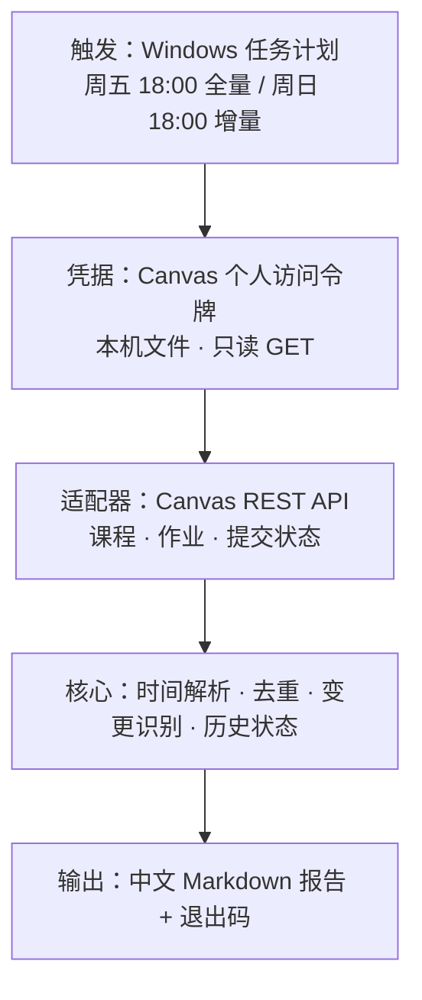

# 校园作业提醒 Agent

**2026 年 9 月 · 个人自动化项目 · 设计与实现已完成，真实账号校验待进行**

把"每周翻遍各门课程找作业截止时间"变成"周五收到一份清单，周日再确认有没有新作业"。

> 本目录公开的是**设计与过程文档**：实现代码保留在本地未公开，原因见下方「代码可见性」。

## 问题

课程作业分散在学校的 Canvas 平台上，每门课都要单独点开看有没有新作业、什么时候截止。
人工检查的难点不在"难"，而在"每周都要重复一次"，而漏看的代价（错过截止）不对称地高。

目标定得很窄：**每周五自动汇总一次未完成作业与截止时间，每周日再检查一次有没有新增。**

## 关键决策：用官方只读接口，而不是抓页面

最初的方案是浏览器自动化——复用登录态打开课程页，逐页读取作业信息。站点侦察改变了这个判断：

| 侦察项 | 结果 |
| --- | --- |
| 学校教学门户 | 自建门户站，不是课程平台本体 |
| 课程平台 | Canvas（官方 REST API 可用） |
| 登录方式 | 统一身份认证（CAS），不是平台自有账号密码 |
| 网络 | 本机直连即可访问，不需要代理 |

统一身份认证意味着"模拟登录"必须牵扯学校密码和二次验证——既不安全也不稳定。
因此改用 **Canvas 官方 API + 个人访问令牌**：令牌由使用者本人在浏览器里登录后生成，
脚本只拿它做只读调用。这一步一次性消掉了三个最脆弱的地方：验证码、二次认证、会话过期。

浏览器会话模式作为备用保留：若平台关闭 API 访问，可切回该模式（机制已实测）。

## 架构

分层的意义在于：只有适配器层与具体平台强相关。时间解析规则、去重逻辑、报告格式各维护一份，
换平台或退回浏览器模式时只替换适配器。

## 五个关键设计决策

### 1. 凭据只读，且随时可撤销

访问令牌只保存在本机私有目录，不写入报告、日志或状态文件，也不进入版本库。
脚本对它**只发只读 GET 请求**：读课程、读作业，没有任何写操作，不提交作业、不改动任何数据。
使用者随时可在平台页面撤销令牌，撤销后脚本会明确报错而不是静默失败。

### 2. 去重键刻意不含截止时间

同一条作业在多次运行之间要靠稳定的键认定为"同一条"。键取「平台作业 ID」，
没有 ID 时退化为「课程 + 规范化标题」，**不包含截止时间**。

原因是反直觉的：如果把截止时间放进键里，老师把截止时间从 10 月 2 日改到 10 月 5 日时，
系统会认为"旧作业消失 + 新作业出现"，使用者收到的是一条"新增"而不是真正有用的
"截止时间变更"。变更提醒就此失效。

### 3. 时间不确定性分四级，绝不猜

页面与接口里的时间表述质量参差不齐。处理原则是分层标注而不是"尽量填一个值"：

| 级别 | 含义 | 处理 |
| --- | --- | --- |
| 原文 | 平台直接给出的值 | 直接采用并保留原文 |
| 派生 | 由原文换算得到 | 采用，标注换算来源 |
| 假定 | 原文缺失、由规则补上（如缺年份、缺具体时刻） | 采用，但显式标注"假定" |
| 存疑 | 完全无法解释（如"按老师通知"） | **不采用**，单独列出交由人工确认 |

宁可报告里写"这条没看懂，请自己看一眼"，也不能编一个看起来合理的截止时间——
漏一次提醒是小事，按错误时间安排时间表是大事。

### 4. 失败与空结果必须区分

最危险的失败模式不是报错，而是**凭据失效时输出一份"本周没有作业"**。
因此把"没抓到"和"确实没有"用退出码严格分开：凭据问题返回专属退出码并明确提示，
报告正文也会写明"本次未读取任何数据"，不会伪装成正常的空清单。

同理，单门课程抓取失败不会中断整轮：失败课程列在报告末尾，其余课程照常出结果。

### 5. 两次提醒各有分工

| 时间 | 模式 | 输出重点 |
| --- | --- | --- |
| 周五 18:00 | 全量 | 所有未完成作业，按「已过期 / 3 天内 / 7 天内 / 更晚」分档 |
| 周日 18:00 | 增量 | 相对周五的**新增与变更**，外加 3 天内截止的事项 |

两次运行共享同一份历史状态，所以周日的"新增"就是相对周五的变化——这正是需求里
"周五扫描、周日看有没有新作业"的含义。任务带开机补跑设置，电脑当时没开机不会漏掉。

## 当前状态

| 环节 | 状态 |
| --- | --- |
| 运行环境与关键机制核实 | 已核实（浏览器自动化可用、登录会话可跨进程保留） |
| 核心逻辑（时间解析 / 去重 / 报告） | 已完成，25 项自动化测试通过 |
| Canvas 适配器 | 已实现，用本地模拟 Canvas 服务验证分页、过滤与状态判定 |
| 凭据失效处理 | 已实现，明确报错并区分退出码 |
| **真实账号跑通** | **待进行，需要使用者本人生成访问令牌** |
| 周五 / 周日定时任务 | 脚本就绪，待注册 |

过程与踩坑记录见[过程记录](development-log.md)。

## 代码可见性

本仓库**不包含实现代码**，公开的是问题定义、架构、设计决策、验证范围与过程记录；
实现（含校园账号相关的接入逻辑）保留在本地。

公开的接口契约（仅约定，不含实现）：

| 环节 | 约定 |
| --- | --- |
| 身份校验 | 用一个只读接口确认凭据有效并取得使用者身份 |
| 课程列表 | 分页读取在修课程，跟随平台的下一页标记直到结束 |
| 作业列表 | 按课程读取作业及本人提交状态，跳过未发布项 |
| 规范化字段 | 课程、作业名、平台作业 ID、截止时间原文、提交状态、页面链接 |

## 结果边界

- 当前覆盖 Canvas 的**作业（Assignments）**；测验、讨论等其他任务类型尚未覆盖，
  需在真实账号上确认课程结构后再决定是否扩展。
- 尚未用真实账号完成一次端到端运行，因此**本项目的运行结果尚无可引用的真实数据**。
- 这是个人效率工具，不代表学校平台的认可或建议；使用自动化访问前应确认学校的使用规定。
- 定时任务只在电脑开机时运行（带开机补跑），不保证严格准时。
