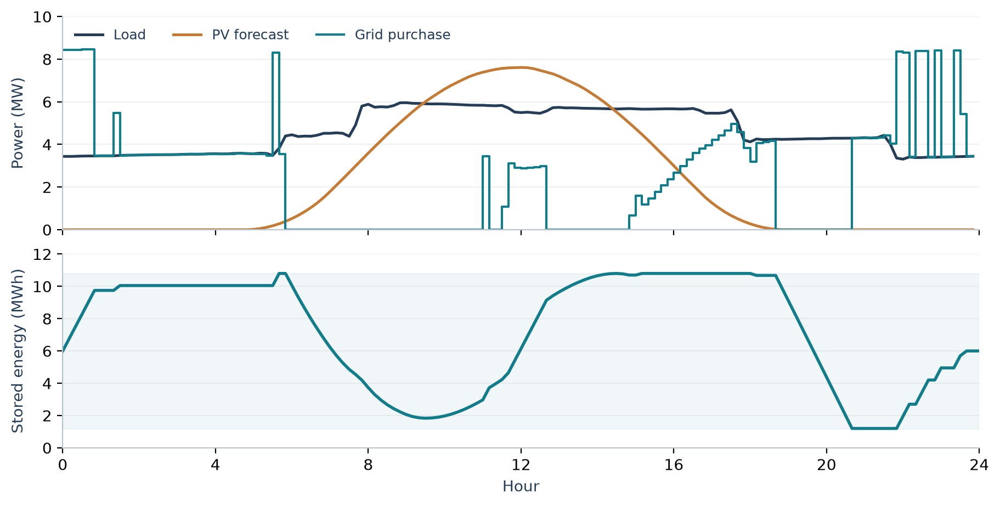
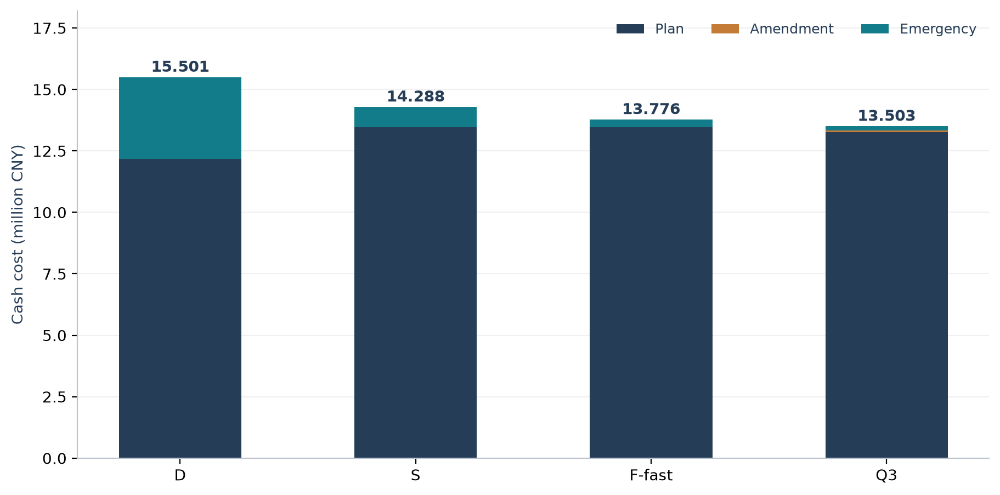

# 微网购电与储能调度：预测不确定性下的策略分析

**2026 年 9 月 · 全国大学生数学建模竞赛 C 题 · 已提交参赛作品（据本人提交记录）**

在负载与光伏存在预测误差时，提前购入多少电、何时使用储能、收到新预报后怎样调整合同？本项目围绕这些决策，建立可追溯的能量与费用账本，再用统一时间范围比较策略。

我的角色是**建模方案审查、研究推进与成果整理**。我参与审题和方案取舍，主动要求重新审查充放电互斥问题并重做第一问，参与后续修订和审阅意见整合，推动论文与支撑材料交付，并确认完成最终人工核验。模型实现、求解、绘图和程序核验使用 AI 辅助；详见[贡献与工具说明](../../docs/contribution-and-ai.md)。

## 从数据到决策

| 层次 | 数据或决策 | 关键口径 |
|---|---|---|
| 观测输入 | 官方附件提供 365 天 × 144 个十分钟位置的负载、光伏和价格 | kW 转为区间 kWh；时间标签按列位置映射 |
| 预报输入 | 每日 0、6、12、18 点发布的光伏预报 | 按发布时间限制可用信息，不能把事后实测提前使用 |
| 决策 | 日前购电额度、储能动作、日内合同调整 | 物理可行与费用口径分开检查 |
| 评价 | 一月共同预热后，2025-02-01 至 12-31 连续 334 日回放 | 总现金与末库存同时报告；结论为回顾性比较 |

## 1. 先分析结构，再选择求解方法

初版用 144 个二元变量描述充放电互斥，共 865 个变量。重新审查后，以储电量的净变化恢复充放电动作，在正电价、允许弃光等给定条件下写成 289 个连续变量的精确线性规划。

题给预测日的费用保持为 **35,126.95 元**，相对无储能参照降低 **26.90%**。这是一个条件明确的代表日结果，不是全年节费率。变量数量减少不能直接解释为经过基准测试的求解加速。



图源：[144 格调度派生表](data/F04_q1_dispatch.csv)。零点与末日库存均为 6000 kWh；同一费用下可能存在多组调度，验证比较目标和可行性，不要求每一格完全一致。

## 2. 费用下降来自哪里



| 策略 | 计划费（万元） | 改约费（万元） | 紧急购电费（万元） | 总现金（万元） | 末库存（kWh） |
|---|---:|---:|---:|---:|---:|
| D：确定性计划 | 1217.17 | 0.00 | 332.89 | 1550.06 | 8008.23 |
| S：场景固定调度 | 1345.87 | 0.00 | 82.98 | 1428.85 | 8221.73 |
| F-fast：场景与日内反馈 | 1346.44 | 0.00 | 31.17 | 1377.60 | 8264.39 |
| Q3：融合预报与分段改约 | 1326.07 | 6.46 | 17.79 | 1350.32 | 8303.87 |

F-fast 相对 S 的计划费增加约 **0.57 万元**，紧急购电费减少约 **51.81 万元**，合计现金减少 **51.24 万元（3.59%）**。因此，改善主要来自缺口费用下降，而非所有费用项一起下降。

Q3 主配置 `Z2_111` 比 F-fast 的现金费用再减少 **27.29 万元**。该配置从已比较全年配置中回顾性选出，两者末库存不同；这里没有把差额称为独立前瞻收益或纯信息价值。

数据：[逐日 Q2 账本汇总](data/F06_q2_annual.csv)、[13 组策略费用与库存](data/strategy_summary.csv)。所有表格按未舍入数据计算，显示值允许出现末位舍入差。

## 3. 预测精度和策略价值需要分别评价

最终研究保留了一个反直觉结果：18 点官方预报在相应比较口径下的误差高于历史预测，完整更新策略却有较低的全年费用。策略表现还与预报融合、剩余决策窗口、储能状态及改约成本共同相关，单个时点的误差不能直接决定是否采用整套策略。

固定储能条件下的合同子问题给出 70% / 90% 分位边界，用来解释增购、保持和退订。该结论有固定储能等适用条件，不能直接推广为所有联动控制的最优定律。

第四问另按均价变化、协方差和重新决策拆解费用变化，见[换价分解数据](data/F12_q4_costs.csv)。协方差描述统计关联，不是因果识别。

## 复现与证据

在仓库根目录安装依赖后：

```shell
python projects/microgrid-2026/verify_representative.py
python scripts/build_figures.py
```

第一个命令重新求解 Q1，检查能量平衡、库存递推、功率边界、互斥与费用，再核对公开年度汇总。完整官方输入运行方式见[复现说明](reproduction/README.md)。

- [本次代表性验证结果](verification/representative.json)
- [本次显式互斥对照与小例检查](verification/small-model-checks.json)
- [研究演进记录](research-history.md)
- [数据字典与来源](data/README.md)
- [完整论文 v17](../../papers/microgrid-2026-v17.pdf)

**结论边界：**当期十分钟实测量近似区间内快速测量与闭环控制条件；动态电价包含“日前已知当日价格”和“以前日价格预测”两种口径。回放数据来自同一年，未作独立未来年份验证；本项目没有声称真实场站部署、现实节费或获奖。
